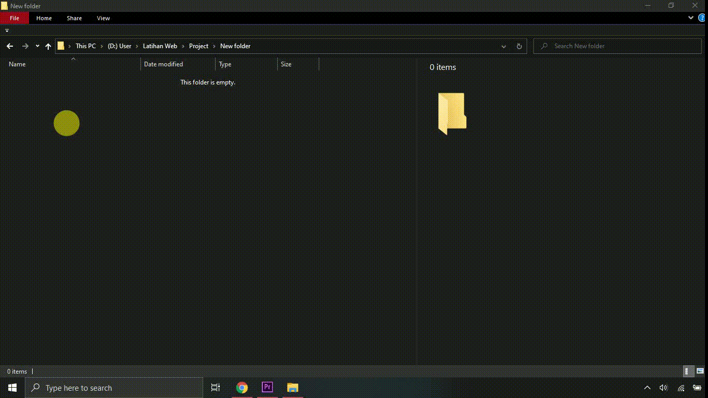

# Zodiak and Shio
## Cara membuat
1. Buat folder baru dan buka di VS - Code. [Download](https://code.visualstudio.com)
2. Buat file index.html

3. Copy starter template dari [Bootstrap](https://getbootstrap.com/ "Menuju halaman bootstrap"), kemudian paste di index.html
4. Ganti title, kemudian buat headingn dan form untuk menangkap inputan tanggal, bulan dan tahun lahir dari user. Jangan lupa untuk memberi nama pada form dan masing-masing inputan untuk kemudian ditangkap oleh DOM
``` html
<h1 class="text-center">- Zodiak and Shio -</h1>
    <form action="" name="form">
    <div class="input-group mb-5">
        <input type="number" name="tanggal" class="form-control" placeholder="Tanggal Lahir">
        <select name="bulan" id="" class="form-control" required>
          <option value="">Bulan</option>
          <option value="1">Januari</option>
          <option value="2">Februari</option>
          <option value="3">Maret</option>
          <option value="4">April</option>
          <option value="5">Mei</option>
          <option value="6">Juni</option>
          <option value="7">Juli</option>
          <option value="8">Agustus</option>
          <option value="9">September</option>
          <option value="10">Oktober</option>
          <option value="11">Nopember</option>
          <option value="12">Desember</option>
        </select>
        <input type="text" name="tahun" class="form-control" placeholder="Tahun">
        <div onclick="cek()" class="btn btn-success">Cek Zodiak</div>
      </div>
    </form>
```
> Disini kami sengaja tidak membuat tombol submit, supaya tidak ada proses redirect.
> Sebagai penggantinya silahkan buat div dengan fungsi `onclick = "cek()"` sebagai penggantinya
5. Oke, kali ini kita akan menggunakan library [Sweetalert.js](https://sweetalert2/github.io). Silahkan tambahkan link CDN berikut di akhir html. Tambahkan juga link ke script.js yang akan kita buat setelah ini
```html
<script src="https://cdn.jsdelivr.net/npm/sweetalert2@11.4.0/dist/sweetalert2.all.min.js"></script>
<script src="js/script.js"></script>
```
> Letakkan link ke javascript pribadi di paling bawah, untuk menghindari kesalahan
6. Buat file script.js didalam folder js/
7. Buatlah fungsi `cek()` yang telah kita inisialisasikan pada even `onclick` sebelumnya. Tangkap inputan menggunakan DOM Selection.
```javascript
const cek = () => {
    const tanggal = document.form.tanggal.value
    const bulan = document.form.bulan.value
    const tahun = document.form.tahun.value
}
```
8. Tambahkan logika pengkondisian untuk memvalidasi inputan dari user. Jika validasi sudah berhasil maka jalankan fungsi `cekzodiak()` dengan mengirimkan tanggal, bulan dan tahun, dan jika validasi gagal, jalankan fungsi `error()` dengan mengirimkan argumen berupa pesan kesalahan. 
```javascript
const cek = () => {
    const tanggal = document.form.tanggal.value
    const bulan = document.form.bulan.value
    const tahun = document.form.tahun.value

    // Validasi Inputan
    if(tanggal == '' || bulan == '' || tahun == '') {
        return error('Form belum dilengkapi')
    }
    if(tanggal < 1 || tanggal > 31) {
        return error('Anda salah memasukkan tanggal..!')
    }
    if(tahun < 1901 || tahun > new Date().getFullYear()) {
        return error('Tahun tidak valid..!')
    }
    if(tanggal == 31) {
        if(
            bulan == 2 || 
            bulan == 4 ||
            bulan == 6 ||
            bulan == 9 ||
            bulan == 11
        ) {
            return error('Tanggal anda salah..!')
        }
        return cekZodiak(tanggal, bulan, tahun)
    }
    if (tanggal > 28 && bulan == 2) {
        if(tanggal == 29 && tahun % 4 == 0) {
            return cekZodiak(tanggal, bulan, tahun)
        } else {
            return error('Tanggal anda salah..!')
        }
    }
    return cekZodiak(tanggal, bulan, tahun)
    
}
```
9. Buat fungsi `error()` dengan inisialisasi objek Swal milik sweetalert.js. Fungsi ini akan mempunyai parameter untuk menangkap pesan error. Fungsi ini akan menampilkan pesan popup sesuai teks yang dikirimkan
```javascript
const error = (pesan) => {
    Swal.fire({
        icon: 'error',
        title: 'Oops...',
        text: pesan
    })
    document.form.reset()
}
```
10. Buat fungsi `cekzodiak()` yang mengandung pengkondisian untuk mengganti zodiak dan shio sesuai inputan user menggunakan fungsi `gantiZodiak()` dan  `gantiShio()`
```javascript

const cekZodiak = (tanggal, bulan, tahun) => {
    
    // Pengkondisian untuk mengganti zodiak
    if (bulan == 1 && tanggal > 19 || bulan == 2 && tanggal <=18 ) {
            gantiZodiak('aquarius')
        } else if (bulan == 2 && tanggal > 18 || bulan == 3 && tanggal <= 20) {
            gantiZodiak('pisces')
        } else if (bulan == 3 && tanggal > 20 || bulan == 4 && tanggal <= 19) {
            gantiZodiak('aries')
        } else if (bulan == 4 && tanggal > 19 || bulan == 5 && tanggal <= 20) {
            gantiZodiak('taurus')
        } else if (bulan == 5 && tanggal > 20 || bulan == 6 && tanggal <= 21) {
            gantiZodiak('gemini')
        } else if (bulan == 6 && tanggal > 21 || bulan == 7 && tanggal <= 22) {
            gantiZodiak('cancer')
        } else if (bulan == 7 && tanggal > 22 || bulan == 8 && tanggal <= 22) {
            gantiZodiak('leo')
        } else if (bulan == 8 && tanggal > 22 || bulan == 9 && tanggal <= 22) {
            gantiZodiak('virgo')
        } else if (bulan == 9 && tanggal > 22 || bulan == 10 && tanggal <= 22) {
            gantiZodiak('libra')
        } else if (bulan == 10 && tanggal > 22 || bulan == 11 && tanggal <= 21) {
            gantiZodiak('scorpio')
        } else if (bulan == 11 && tanggal > 21 || bulan == 12 && tanggal <= 21) {
            gantiZodiak('sagitarius')
        } else if (bulan == 12 && tanggal > 21 || bulan == 1 && tanggal <= 19) {
            gantiZodiak('capricorn')
        } else {
            console.log('Eror');
        }


        // Pengkondisian untuk mengganti shio
        if(((1901 - tahun)%12) == 1 ||((1901 - tahun)%12) == -11) {
            gantiGambar('mouse.png')
            //tikus
        } else if (((1901 - tahun)%12) == 0) {
            gantiGambar('buffalo.png')
            //Kerbau
        } else if (((1901 - tahun)%12) == 11 ||((1901 - tahun)%12) == -1) {
            gantiGambar('tiger.png')
            //Macan
        } else if (((1901 - tahun)%12) == 10 ||((1901 - tahun)%12) == -2) {
            gantiGambar('hare.png')
            //Kelinci
        } else if (((1901 - tahun)%12) == 9 ||((1901 - tahun)%12) == -3) {
            gantiGambar('dragon.png')
            //Naga
        } else if (((1901 - tahun)%12) == 8 ||((1901 - tahun)%12) == -4) {
            gantiGambar('snake.png')
            //Ular
        } else if (((1901 - tahun)%12) == 7 ||((1901 - tahun)%12) == -5) {
            gantiGambar('horse.png')
            //Kuda
        } else if (((1901 - tahun)%12) == 6 ||((1901 - tahun)%12) == -6) {
            gantiGambar('goat.png')
            //Kambing
        } else if (((1901 - tahun)%12) == 5 ||((1901 - tahun)%12) == -7) {
            gantiGambar('monkey.png')
            //Monyet
        } else if (((1901 - tahun)%12) == 4 ||((1901 - tahun)%12) == -8) {
            gantiGambar('gallic-rooster.png')
            //Ayam
        } else if (((1901 - tahun)%12) == 3 ||((1901 - tahun)%12) == -9) {
            gantiGambar('dog.png')
            //Anjng
        } else if (((1901 - tahun)%12) == 2 ||((1901 - tahun)%12) == -10) {
            gantiGambar('pig.png')
            //Babi
        } else {
            //Error
        }
}
```
11. Sebelumnya, buatlah wadah untuk menampilkan di browser, letakkan di bawah form
> Pastikan anda sudah mempunyai semua [asset yang diperlukan](https://drive.google.com/drive/folders/17pVFP14trNqZnIsdROFcL6Z2WHVSAlMl?usp=sharing)
```html
<div class="row">
      <div class="col-3">
        
      </div>
      <div class="col-1"></div>
      <div class="col-8 d-none" id="ready">
        <h2 class="text-center" id="judul">PISCES</h2>
        <hr>
        <h5>Umum</h5>
        <p id="umum"></p>
        <h5>Cinta</h5>
        <p id="cinta"></p>
        <h5>Karir</h5>
        <p id="karir"></p>
        <h5>Keuangan</h5>
        <p id="uang"></p>
      </div>
      <div class="col-8" id="default">
        <h2 class="text-secondary">Isi Form Dulu Ya,</h2>
      </div>
    </div>
```
> Div dengan `id="default"` berfungsi untuk menampilkan halaman default saat user belum menginputkan tanggal lahir
12. Tangkap div default (tampilan default), div ready (tampilan zodiak), dan img (mengubah gambar shio) menggunakan DOM Selection. Letakkan diluar semua fungsi
```javascript
const def = document.getElementById('default')
const ready = document.getElementById('ready')
const img = document.getElementById('gambar')
```
13. Tambahkan beberapa baris didalam fungsi `error()`
```javascript
// Togle kelas d-none dari bootstrap
def.classList.remove('d-none')
ready.classList.add('d-none')
// Gambar default setelah error
img.src = 'img/question.png' 
```
14. Buat fungsi `gantiGambar()`
```javascript
const gantiGambar = (src) => {
    img.src = 'img/' + src
}
```
15. Buat fungsi `gantiZodiak()`
```javascript
const gantiZodiak = (namaZodiak) => {
    judul = document.getElementById('judul')
    umum = document.getElementById('umum')
    cinta = document.getElementById('cinta')
    karir = document.getElementById('karir')
    uang = document.getElementById('uang')
    zodiak = [
                {
                    "nama" : "aquarius",
                    "detail" : {
                        "umum" : "Saat ini menjadi waktu yang sangat baik bagimu, kamu akan menjadi orang yang lebih optimis dan positif karena mendapatkan dukungan dari sekitar. Kesehatanmu terbilang cukup baik, walau alaergimu sering muncul karena mengonsumsi makanan yang salah.",
                        "cinta" : "Single: Meskipun dirimu menginginkan gejolak asmara, namun dirimu belum memprioritaskan hubungan asmara untuk saat ini.<br>Couple: Lakukan apa saja yang membuatmu bahagia dalam hubungan, selama itu membuatmu dan pasangan nyaman dan tidak mengganggu komitmen.",
                        "karir" : "Meskipun akan menemui banyak kesulitan dalam pekerjaan, tetapi jangan sampai patah semangat dan ingin menyerah. Dalam bisnis, dirimu akan menemukan partner sejati yang akan mendukung usahamu.",
                        "uang" : "Pinjamkanlah uang secukupnya pada orang lain dan jangan suka merasa tidak enak, ini demi kenyamananmu."

                    }
                },
                {
                    "nama" : "pisces",
                    "detail" : {
                        "umum" : "Bersikap angkuh hanya akan mengurangi keberuntunganmu dalam hidup, pandailah berterima kasih pada orang di sekitarmu selalu latih rasa syukur pada kehidupanmu saat ini. Rasa pegal berlebih yang dirasakan setelah selesai bekerja mungkin bisa kamu atasi dengan lebih banyak beristirahat dan berolahraga.",
                        "cinta" : "Single: Menunggu sosok yang bisa melengkapimu dan membuatmu bahagia bukanlah hal yang bisa kamu lakukan karena itu bisa membuatmu lelah karena kamu bukan orang yang sabaran.<br>Couple: Mengenal lama dengan pasangan bukan berarti dirimu tak bisa menemukan hal baru dan mengejutkan dari pasangan. Jadi luangkanlah lebih banyak waktu agar dapat menguatkan sisi emosional antara kalian",
                        "karir" : "Jika ingin perkembangan dan perubahan dalam pekerjaan, sebaiknya pikirkan semuanya secara realistis agar tidak termakan ambisi. Menjalin komunikasi yang baik dengan relasi atau kolega akan menjadi kesempatan yang baik dalam bisnis.",
                        "uang" : "Beberapa masalah keuangan akan membuatmu berpikir serius untuk mempertahankan kondisi finansial."
                    }
                },
                {
                    "nama" : "taurus",
                    "detail" : {
                        "umum" : "Selama tahu tempatnya, tak mengapa untuk meluapkan kekesalan atau kemarahan, tetapi jangan sampai hal itu membuat hubunganmu terganggu dengan orang sekitar. Jika ingin mendapatkan berat badan yang ideal, cobalah dengan lebih memprioritaskan makanan yang sehat",
                        "cinta" : "Single: Memaksakan diri untuk menjalani kisah cinta padahal di saat belum siap bisa menjadi berbahaya. Jadi lakukanlah saat dirimu sudah merasa siap<br>Couple: Sebaiknya jangan terburu-buru untuk membawa hubungan ke jenjang pernikahan karena banyak hal yang perlu dipersiapkan secara matan",
                        "karir" : "Memiliki rekan kerja yang bisa diajak diskusi tentang masalah apapun akan membuat bebanmu sedikit lebih ringan. Dalam bisnis, jangan sampai terlalu kaku sehingga tak banyak melakukan perubahan, dirimu harus berkembang",
                        "uang" : "Saat ini pengeluaranmu sedang banyak sekali, pikirkan cara terbaik untuk mendapatkan penghasilan tambahan"
                    }
                },
                {
                    "nama" : "cancer",
                    "detail" : {
                        "umum" : "Karena sifatmu yang sering agresif bahkan cenderung keras kepala, kemungkinan itu akan membuatmu menjatuhkan diri sendiri. Jadi, kamu butuh bersama orang yang bisa meredam emosimu. Kelelahan mata saat beraktivitas bisa diakibatkan karena penggunaan barang elektronik secara berlebih, jadi baiknya gunakan waktu untuk beristirahat.",
                        "cinta" : "Single: Jika dirimu sangat menikmati waktu sendiri atau melajang seperti saat ini, maka gunakanlah waktu yang dimiliki untuk melakukan sesuatu yang berkualitas.<br>Couple: Hubungan yang sudah berjalan lama pun bukan berarti tak ada masalah. Jadi, sebisa mungkin dirimu dan pasangan harus bisa menghilangkan kesalahpahaman yang sering muncul.",
                        "karir" : "Jika ingin berbicara dengan atasan mengenai masalah serius, maka lakukanlah saat suasana hatinya dalam kondisi yang baik. Persaingan bisnis mungkin akan membuatmu lebih terpacu untuk melakukan perubahan yang inovatif.",
                        "uang" : "Jika ingin menambah nominal tabungan, maka hilangkanlah kebiasaan buruk yang suka menghamburkan uang dengan impulsif."
                    }
                },
                {
                    "nama" : "gemini",
                    "detail" : {
                        "umum" : "Kamu mungkin akan lebih banyak mengalami kebimbangan dan ketidakpastian. Jika ingin menjalankan hal dengan lancar, kamu harus bisa bekerja sama yang baik dengan orang lain. Untuk menunjang aktivitasmu tetap lancar, jangan lupa untuk sarapan setiap paginya.",
                        "cinta" : "Single: Kesempatan untuk mendapatkan cinta itu selalu ada, tetapi jika dirimu terus menahan dirimu maka tak akan ada perubahan yang berarti.<br>Couple: Ketika ada perbedaan cara dalam menangani masalah antara dirimu dan pasangan, jika tidak ada yang mau mengalah maka akan rentan memunculkan pertengkaran dalam hubungan.",
                        "karir" : "Ketika bisa bekerja dengan produktif, akan ada banyak hasil yang bisa diharapkan. Dalam bisnis, saat ada masalah, sebisa mungkin carilah jalan keluar yang tak merugikan pihak mana pun.",
                        "uang" : "Jika bertahan dengan gaya hidup yang sembarangan, dirimu akan banyak kehilangan uang."
                    }
                },
                {
                    "nama" : "scorpio",
                    "detail" : {
                        "umum" : "Banyak kemudahan yang akan terjadi dalam urusan pribadimu, jika ada yang mengganggu pikiranmu belakangan ini maka kamu akan segera menemukan solusinya. Tak menjaga pola makan dan istirahat adalah penyebab utama kamu rentan terkena penyakit, baiknya dipeerhatikan",
                        "cinta" : "Single: Jika dirimu mengharapkan kisah cinta yang romantis, maka dirimu harus lebih bersahabat karena semua butuh proses.<br>Couple: Ada kalanya dirimu jangan boleh untuk tidak terlalu memerhatikan perkataan pasangan yang mungkin menyinggungmu, karena bisa jadi dia mengatakannya dalam keadaan tak sengaja",
                        "karir" : "Keluarga dan orang terdekat akan sangat mendukung pilihan kariermu saat ini. Dalam bisnis, jangan menumpuk dan mengabaikan masalah kecil yang sewaktu-waktu bisa menjadi besar.",
                        "uang" : "Jangan menggunakan self reward untuk membenarkan perilaku boros, itu akan berdampak buruk pada kondisi keuanganmu."
                    }
                },
                {
                    "nama" : "leo",
                    "detail" : {
                        "umum" : "Kamu akan bisa melakukan dan menyelesaikan sesuatu yang sudah kamu rencanakan sejak lama. Bahkan banyak keberuntungan yang hadir dalam hidupmu. Kecemasan terhadap sesuatu bisa membuatmu stres, disarankan untuk mengonsumsi makanan yang lebih sehat dan memperbanyak istirahat.",
                        "cinta" : "Single: Saat dirimu bisa membuka diri pada orang lain, maka dirimu hanya tinggal menunggu cinta yang datang dengan sendirinya.<br>Couple: Walaupun kehidupan cintamu dengan pasangan sempat naik dan turun, tetapi itulah yang membuat hubunganmu terasa lebih menarik dan menantang.",
                        "karir" : "Keberhasilanmu dalam pekerjaan tergantung dari seberapa rajin dan seberapa ulet dirimu. Dalam bisnis, membuat mitra nyaman dengan sikapmu akan menjadi sebuah modal tambahan.",
                        "uang" : "Belilah barang-barang baru jika barang lama sudah tak terpakai, itu akan membantumu menghemat keuangan."
                    }
                },
                {
                    "nama" : "sagitarius",
                    "detail" : {
                        "umum" : "Kamu memiliki lebih banyak kekuasaan untuk membuat dirimu lebih fokus dalam berbagai hal yang ingin dilakukan. Walau multitasking membuat pekerjaanmu lebih mudah, tetapi jangan dibiasakan karena bisa memecah konsentrasimu.",
                        "cinta" : "Single: Cinta bisa datang dari hal-hal terdekat, dan dirimu cenderung jatuh cinta dengan seseorang yang sudah lama dikenal.<br>Couple: Ketika terlalu tenggelam pada perasaan, dirimu mungkin sering mengabaikan logika dan kebenaran yang akan menjauhkanmu dari drama.",
                        "karir" : "Perkembangan baik yang menjanjikan akan terjadi dalam pekerjaan dan kariermu. Dalam bisnis, sebaiknya berhentilah bekerja sama dengan mitra yang tidak kooperatif dan hanya merugikanmu.",
                        "uang" : "Ketika pekerjaan sampingan tak mengganggu pekerjaan utama, dirimu akan bisa meraup penghasilan lebih banyak."
                    }
                },
                {
                    "nama" : "capricorn",
                    "detail" : {
                        "umum" : "Secara umum, kamu mampu mendapatkan apa pun yang diinginkan karena dirimu dapat bekerja sama dengan orang-orang yang tepat. Kesehatanmu dalam kondisi yang baik, karena kamu sangat memerhatikan diri dengan baik.",
                        "cinta" : "Single: Jangan sampai dirimu terlalu terpaku pada tuntutan sosial yang selalu memojokkanmu dengan status singlemu saat ini, dirimu harus bisa mengambil sikap yang tegas.<br>Couple: Dirimu akan bisa membawa hubungan yang penuh dengan harmoni, selama kalian bisa saling percaya satu sama lain dan saling mendukung.",
                        "karir" : "Dirimu akan merasa persaingan semakin jelas dalam pekerjaan, dirimu hanya perlu menunjukkan kinerja terbaikmu. Dalam bisnis, gunakanlah ide kreatifmu untuk membuat inoivasi yang unik dan disukai banyak orang.",
                        "uang" : "Selalu catat setiap transaksi keuangan yang dilakukan agar tidak bingung di kemudian hari."
                    }
                },
                {
                    "nama" : "aries",
                    "detail" : {
                        "umum" : "Kamu mungkin sedang dalam suasana hati yang kurang baik, sehingga kamu mudah terpicu secara emosional dan cenderung memgeluarkan kemarahan. Agar sirkulasi darah dan metabolisme tetap lancar, jangan lupa untuk minum air putih yang banyak setiap harinya.",
                        "cinta" : "Single: Mungkin dirimu merasa tertinggal banyak dari orang di sekitarmu dalam urusan cinta, tetapi dirimu tak perlu tergesa-gesa atau memaksakan hingga datang waktu yang tepat.<br>Couple: Komitmenmu dalam hubungan mungkin akan diuji dengan berbagai masalah, namun ini akan membuat hubunganmu menjadi semakin kuat.",
                        "karir" : "Pekerjaan mungkin akan menguras waktumu dan rawan membuatmu stres, sebaiknya luangkan waktu untuk memanjakan diri. Dalam bisnis, menyelesaikan masalah administrasi sepertinya harus segera dilakukan.",
                        "uang" : "Pengeluaranmu mungkin banyak saat ini, tetapi itu tidak membuatmu kekurangan."
                    }
                },
                {
                    "nama" : "libra",
                    "detail" : {
                        "umum" : "Kepuasan terhadap pencapaian akan memenuhi hatimu saat ini. Kamu hanya perlu menyeimbangkan harmoni antara kekuatan emosional dan pikiran. Kamu perlu memerhatikan kesehatanmu, karena perubahan cuaca atau lingkungan bisa memengaruhi kondisi tubuhmu.",
                        "cinta" : "Single: Dengan memberi cinta pada diri sendiri dan percaya pada kemampuanmu, justru hal itulah yang akan membuatmu mudah dicintai orang lain, karena dirimu begitu menarik.<br>Couple: Kebahagiaan yang dirasakan saat berhasil berdamai setelah bertengkar dengan pasangan akan teras lebih mendalam dan membawa harmoni dalam hubungan.",
                        "karir" : "Ketika bisa memberikan kinerja terbaik, maka hasil tak akan pernah membuatmu kecewa. Dalam bisnis, dirimu perlu untuk mengevaluasi kekurangan untuk menemukan solusinya.",
                        "uang" : "Jangan sampai mengorbankan tabungan untuk hal-hal yang berada di luar rencana keuanganmu itu akan membuatmu semakin boros."
                    }
                },
                {
                    "nama" : "virgo",
                    "detail" : {
                        "umum" : "Kepuasan terhadap pencapaian akan memenuhi hatimu saat ini. Kamu hanya perlu menyeimbangkan harmoni antara kekuatan emosional dan pikiran. Kamu perlu memerhatikan kesehatanmu, karena perubahan cuaca atau lingkungan bisa memengaruhi kondisi tubuhmu.",
                        "cinta" : "Single: Dengan memberi cinta pada diri sendiri dan percaya pada kemampuanmu, justru hal itulah yang akan membuatmu mudah dicintai orang lain, karena dirimu begitu menarik.<br>Couple: Kebahagiaan yang dirasakan saat berhasil berdamai setelah bertengkar dengan pasangan akan teras lebih mendalam dan membawa harmoni dalam hubungan.",
                        "karir" : "Ketika bisa memberikan kinerja terbaik, maka hasil tak akan pernah membuatmu kecewa. Dalam bisnis, dirimu perlu untuk mengevaluasi kekurangan untuk menemukan solusinya.",
                        "uang" : "Jangan sampai mengorbankan tabungan untuk hal-hal yang berada di luar rencana keuanganmu itu akan membuatmu semakin boros."
                    }
                }
            ]
    zodiak.forEach(z => {
        if (z.nama == namaZodiak) {
            judul.innerHTML = z.nama.toUpperCase()
            umum.innerHTML = z.detail.umum
            cinta.innerHTML = z.detail.cinta
            karir.innerHTML = z.detail.karir
            uang.innerHTML = z.detail.uang
            
        }

    });
    def.classList.add('d-none')
    ready.classList.remove('d-none')
}
```
## Terimakasih, Aplikasi zodiak anda sudah siap. Silahkan dibuka di Browser 😉
